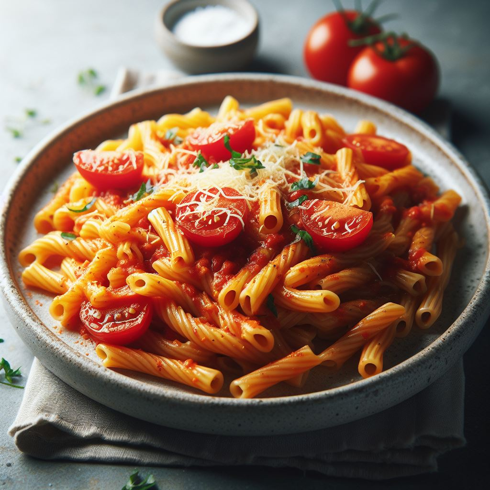
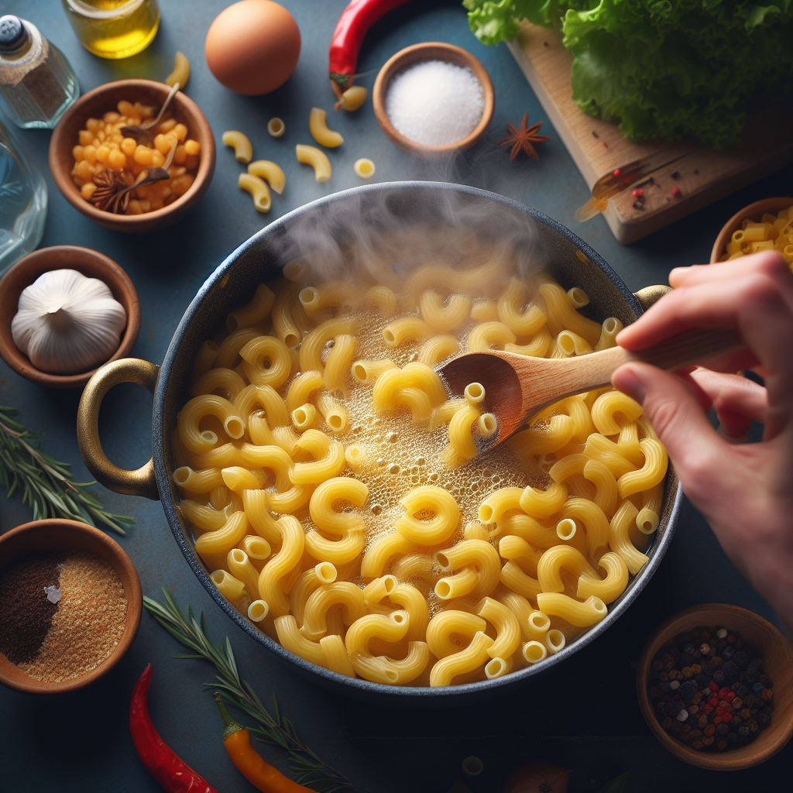
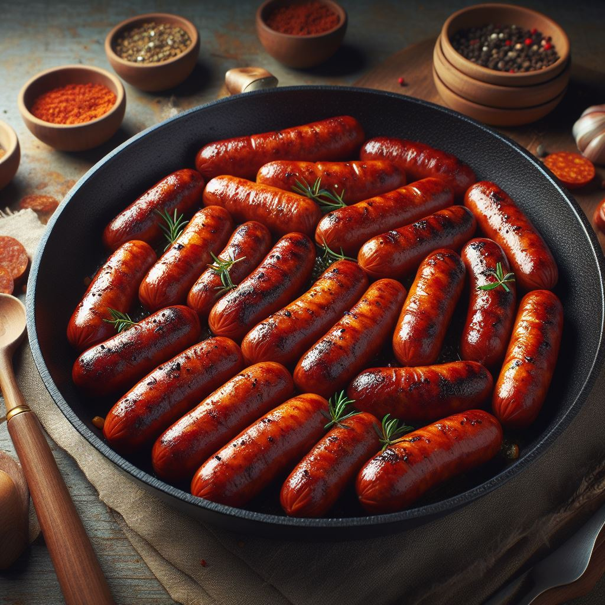
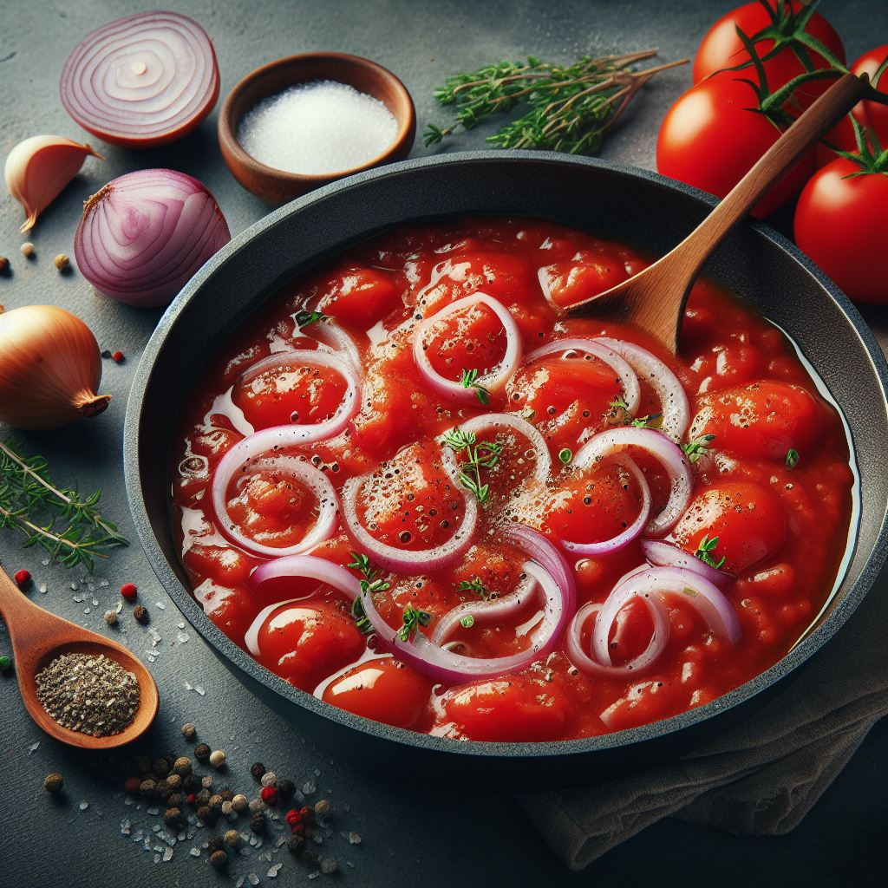
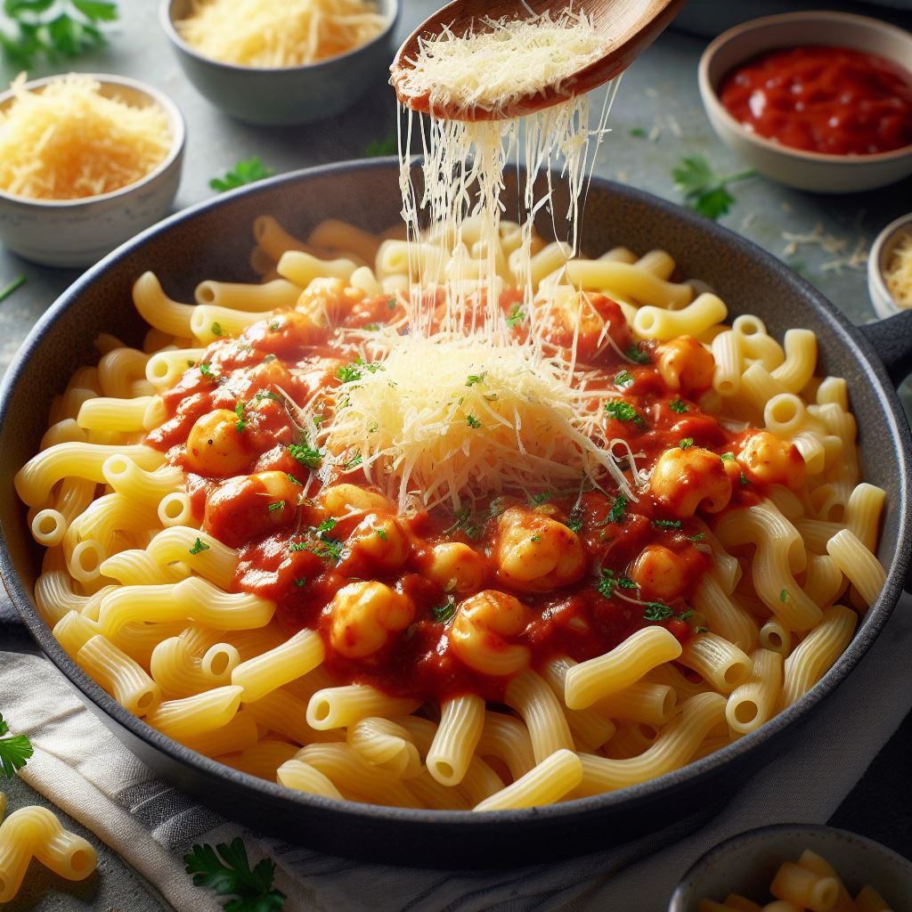

# MACARRONES CON TOMATE 

  

Experience the taste of Spain with Macarrones con Tomate, a delightful blend of macaroni and tangy tomato sauce. This easy-to-follow recipe, enhanced with optional chorizo, is perfect for all cooks. Enjoy this Spanish culinary journey!
  

  

---

#### Ingredients:

* **400 g of macaroni**
* **1 onion**
* **800 g of tomato puree**
* **1 teaspoon of sugar**
* **1 teaspoon of dried oregano**
* **2 chorizo sausages**
* **Salt and black pepper to taste**
* **Extra virgin olive oil**

---
     

1. Cook the macaroni in a large pot of boiling salted water until al dente, according to the package instructions. Drain and set aside.
   

  

2. In a large skillet over medium-high heat, heat some oil and cook the chorizo sausages until browned and crisp, turning occasionally. Transfer to a plate and keep warm.
   

  

3. In the same skillet over medium heat, add more oil if needed and sauté the onion until soft and translucent, about 15 minutes. Add the tomato puree, sugar, oregano, salt and pepper and bring to a boil. Reduce the heat and simmer until slightly thickened, about 20 minutes.
   

  

4. Add the cooked macaroni to the sauce and toss well to combine. Sprinkle with some grated manchego cheese if you like. Serve hot with some chopped parsley on top.
   

  

Enjoy your Spanish macarrones con tomate! 😋

<iframe width="800" height="500" src="https://www.youtube.com/embed/GFKZpLwAvTc?si=zfT9PvyHcTiHHrjH" title="YouTube video player" frameborder="0" allow="accelerometer; autoplay; clipboard-write; encrypted-media; gyroscope; picture-in-picture; web-share" allowfullscreen=""></iframe> 

 You can also see the video by clicking [here](https://www.youtube.com/embed/GFKZpLwAvTc?si=zfT9PvyHcTiHHrjH)

---

     

### COMMENTS ON THE RECIPE

  

**Username:** EpicureanExplorer **Date:** March 19, 2024

>“I recently had the pleasure of trying the Macarrones con Tomate recipe, and it was a >delightful experience. The combination of al dente macaroni with the rich and tangy tomato >sauce was a treat for the taste buds. The addition of chorizo added a lovely depth of flavor >and a slight kick that elevated the dish. The recipe was straightforward and easy to follow, >making it a perfect choice for a weeknight dinner or a casual gathering with friends. I >appreciated the optional touch of manchego cheese, which added a creamy texture and a >hint of sharpness. Overall, this dish is a wonderful way to bring a piece of Spain into your >kitchen. It’s definitely a recipe I’ll be returning to!”

  

**Username:** CulinaryCritic **Date:** March 19, 2024

> “Absolutely loved the Macarrones con Tomate! It’s a simple yet flavorful dish that brings a taste of Spain right to your table. Perfect for a quick, delicious meal.”

  

**Username:** DisappointedDiner **Date:** March 19, 2024

> “Found the Macarrones con Tomate bland and uninspiring. Would not recommend.”